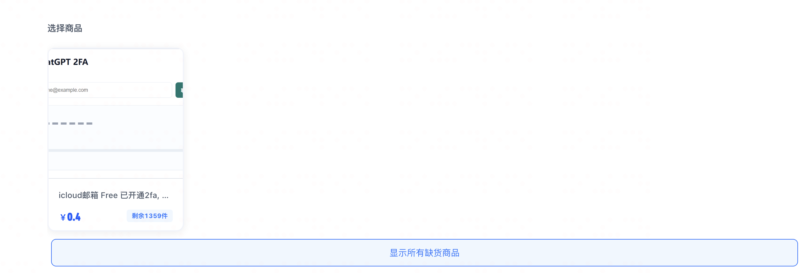

# 猴毛（Houmao）

一撮实用的油猴脚本。

> One strand, countless forms.

## 安装

1. 浏览器安装 Tampermonkey、Violentmonkey 或同类用户脚本扩展。
2. 在下方脚本列表点击“安装”。
3. 扩展打开安装页后确认安装；后续版本会按脚本的 `@version` 自动更新。

## 脚本

- **卡网库存助手**：显示百件以下的准确库存、隐藏缺货商品，并可一键显示全部缺货商品（[安装](https://raw.githubusercontent.com/fanjindong/houmao/main/scripts/ldxp-hide-out-of-stock.user.js) · [源码](scripts/ldxp-hide-out-of-stock.user.js) · [说明](docs/ldxp-hide-out-of-stock.md)）。
- **LINUX DO 帖子过滤器**：按标题关键字、标签名称或类别名称隐藏帖子，并可在保存设置前预览过滤结果（[安装](https://raw.githubusercontent.com/fanjindong/houmao/main/scripts/linux-do-topic-filter.user.js) · [源码](scripts/linux-do-topic-filter.user.js) · [说明](docs/linux-do-topic-filter.md)）。

### 卡网库存助手效果

打开商铺页面后，脚本会自动隐藏缺货商品，并在商品列表底部显示“显示所有缺货商品”按钮。



点击“显示所有缺货商品”后，页面会展示全部缺货商品。


## 测试

```sh
sh tests/run.sh
```
