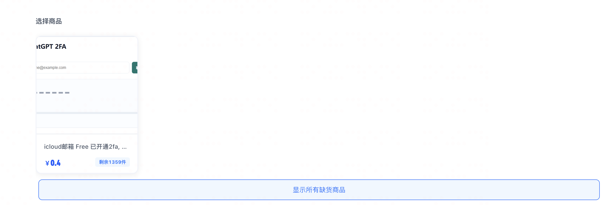
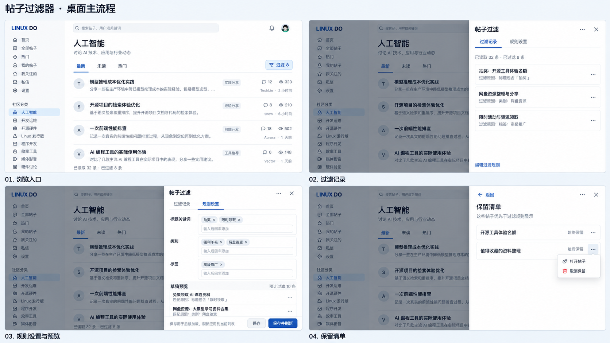
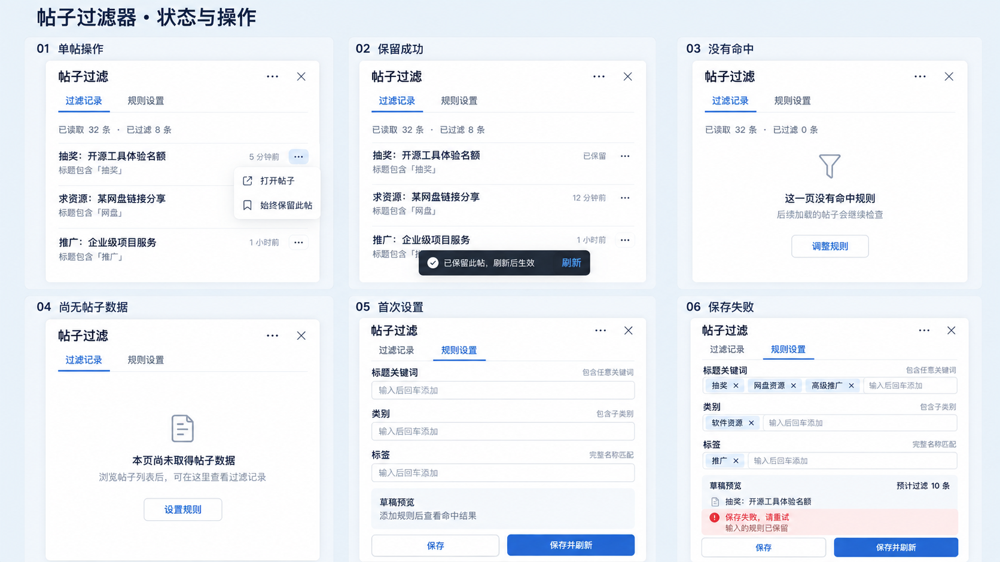

# 猴毛（Houmao）

一撮实用的油猴脚本。

> One strand, countless forms.

## 安装

1. 浏览器安装 Tampermonkey、Violentmonkey 或同类用户脚本扩展。
2. 在下方脚本列表点击“安装”。
3. 扩展打开安装页后确认安装；后续版本会按脚本的 `@version` 自动更新。

## 脚本

- **卡网库存助手**：显示百件以下的准确库存、隐藏缺货商品，并可一键显示全部缺货商品（[安装](https://raw.githubusercontent.com/fanjindong/houmao/main/scripts/ldxp-hide-out-of-stock.user.js) · [源码](scripts/ldxp-hide-out-of-stock.user.js) · [说明](docs/ldxp-hide-out-of-stock.md)）。
- **LINUX DO 帖子过滤器**：从列表工具栏打开侧栏，查看实际过滤记录，按标题、标签或类别编辑过滤词条并预览结果，支持保留清单及保存并刷新（[安装](https://raw.githubusercontent.com/fanjindong/houmao/main/scripts/linux-do-topic-filter.user.js) · [源码](scripts/linux-do-topic-filter.user.js) · [说明](docs/linux-do-topic-filter.md)）。

### 卡网库存助手效果

打开商铺页面后，脚本会自动隐藏缺货商品，并在商品列表底部显示“显示所有缺货商品”按钮。



点击“显示所有缺货商品”后，页面会展示全部缺货商品。


### LINUX DO 帖子过滤器功能

以下界面原型使用示例帖子，展示过滤器的主要功能与操作流程。

#### 桌面主流程

从帖子列表工具栏中的“过滤 N”打开右侧面板，查看过滤记录、编辑规则，或进入保留清单。



- **过滤数量与原因**：查看本页已读取、已过滤的帖子数量，以及每条记录命中的标题关键词、标签或类别。
- **词条式规则编辑**：支持回车添加、逐项删除及多行粘贴。标题按关键词匹配，标签按完整名称匹配，类别规则覆盖子类别。
- **草稿预览**：编辑时查看预计过滤的帖子；切换页签保留草稿，实际过滤记录保留处理当时的结果。
- **选择生效时机**：“保存”用于后续加载，“保存并刷新”让当前列表立即采用新规则。

#### 状态与单帖操作

通过每条记录的“⋯”菜单打开帖子或选择“始终保留此帖”。保留设置优先于过滤规则，刷新后该帖可恢复到当前主列表；日后可在“保留清单”中撤销保留。



“没有命中规则”与“尚未取得帖子数据”分别提示，便于判断过滤状态。保存失败时保留输入的草稿并显示错误，稍后可再次保存。

#### 窄屏布局

窄屏下使用全屏面板，内容独立滚动，保存操作固定在底部。浏览入口、过滤记录与规则设置保持一致的操作顺序。


详细操作、匹配规则与键盘支持见[使用说明](docs/linux-do-topic-filter.md)。

## 测试

```sh
sh tests/run.sh
```
